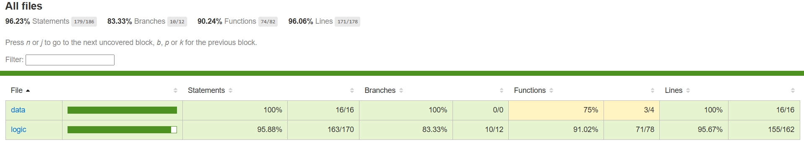

# Aplicacion CocinArte (falta definir nombre)

## Intro

Esta aplicación web permite a los usuarios crear, ver y compartir recetas de cocina de manera sencilla y rápida. Pensada para quienes disfrutan cocinar en casa sin complicaciones, la plataforma ofrece una experiencia intuitiva tanto para usuarios principiantes como experimentados.

El objetivo principal del proyecto es ofrecer una herramienta que fomente la cocina casera, organizando las recetas de forma clara y permitiendo compartirlas.

## Functional

Esta aplicación permite a los usuarios:
- Crear nuevas recetas con título, descripción, imagen y lista de ingredientes.
- Modificar las recetas existentes.
- Eliminar recetas que ya no deseen compartir.
- Marcar recetas con un "like" para mostrar preferencia.
- Ver las recetas publicadas por otros usuarios, así como sus recetas favoritas.

## Use Cases

User 
- publish a recipe
- modify recipe
- remove recipe
- toggle like recipe
- view recipes
- view liked recipes

### UIUX Design
[Figma](https://www.figma.com/design/125jupY0bbtEOsGY0PItvS/Untitled?node-id=0-1&p=f&t=JAgxOb3bMUzG9naM-0)

## Technical

### Blocks
- App
- API
- Db
 ### Packages

 ### Packages

- **Frontend**
  - React
  - TailwindCSS
  - Vite

- **Backend**
  - Express
  - JWT
  - bcrypt
  - Mongoose
  - MongoDB

### Data Model

User
- id (string, uuid)
- name (string, min length 1, max length 20)
- email (string, max length 30)
- username (string, min length 3, max length 20)
- password (string, min length 8, max length 20)
- createdAt (Date)
- modifiedAt (Date)

Recipe
- id (string, uuid)
- author (User.id)
- image (string, max length 1000)
- title (string, max length 100)
- description (string, max length 2000)
- createdAt (Date)
- modifiedAt (Date)
- likes ([User.id])
- cookingTime(number)
- ingredients([string])

### Technologies

- HTML / Tailwind / JS
- React / Vite
- Express / Node

- MongoDB/Mongoose

Autenticacion y seguridad.

- JWT(JSON web Token)
- bcrypt.

### Code Coverage

La cobertura de pruebas de la aplicación cubre las funcionalidades principales, incluyendo:

- Pruebas de autenticación de usuarios.
- Pruebas de la creación, modificación y eliminación de recetas.
- Pruebas de la funcionalidad de likes.

## Planning
[Issue Tracking](https://github.com/b00tc4mp/isdi-bootcamp-202501/issues/79)